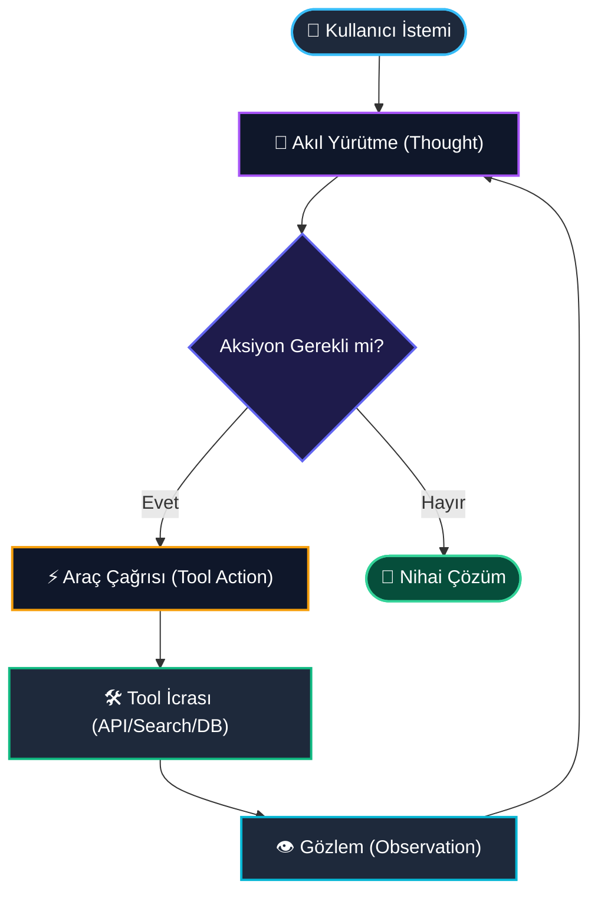
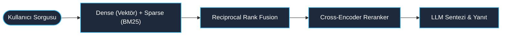
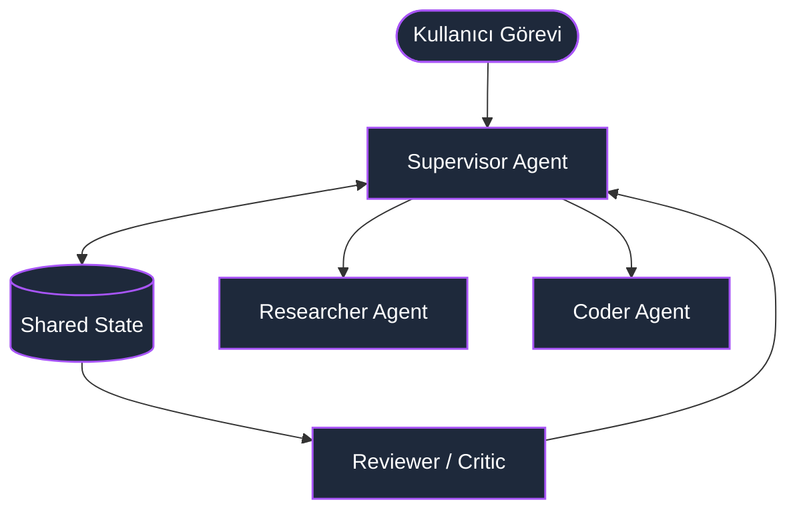

# Pull Request: 🚀 6 Haftalık Müfredat Slayt Destesi, Teknik Mimari Diyagramları ve Görsel Prompt Seti

## 📋 Özet (Overview)
Bu Pull Request, **Türkiye Veri Topluluğu AI Agents Bootcamp** repository'sine kapsamlı sunum materyalleri, modüler teknik mimari diyagramları ve yapay zekâ destekli görsel üretim promptları kazandırmaktadır. 

Mevcut repository yapısına zarar vermeden, tüm sunum ve görselleştirme kaynakları modüler bir `presentation/` dizini altında toplanmış ve hem eğitmenlerin hem de öğrencilerin kolayca erişebileceği biçimde belgelenmiştir.

---

## 🎯 Yapılan Değişiklikler ve Motivasyon (Motivation & Changes)

1. **Modüler Sunum Dosyası (`presentation/slides/bootcamp_deck.md`):**
   - 6 haftalık müfredatın tamamını kapsayan, **Marp** ve **Slidev** uyumlu modern slayt destesi eklendi.
   - Her hafta için net teknik odak noktaları (Tokenizasyon, ReAct, Hybrid RAG, Multi-Agent LangGraph, Observability) ve eğitmenlere rehberlik eden detaylı **Speaker Notes** (konuşmacı notları) entegre edildi.
   - Koyu tema (Dark mode) ve Türkiye Veri Topluluğu renk paletine (`#0F172A`, `#38BDF8`, `#A78BFA`) uygun özel CSS stilleri tanımlandı.

2. **Teknik Mimari Diyagramları (`presentation/assets/diagrams/`):**
   - GitHub Markdown ve Mermaid araçlarıyla %100 uyumlu, yüksek okunurluklu 3 temel mimari diyagram oluşturuldu:
     * `single_agent_cycle.mmd`: ReAct (Thought-Action-Observation) döngüsü ve karar matrisi.
     * `advanced_rag_flow.mmd`: Ingestion, Dense+Sparse Hybrid Retrieval, Reciprocal Rank Fusion (RRF) ve Cross-Encoder Reranker boru hattı.
     * `multi_agent_orchestration.mmd`: Supervisor/Orchestrator, Worker Agent'lar (Researcher, Coder, Critic) ve paylaşılan State Graph mimarisi.

3. **Kapsamlı Teknik Ders Notları & Rehber (`presentation/docs/curriculum_deep_dive.md`):**
   - 6 haftanın tamamını kapsayan teorik arka plan, BPE tokenizasyon, Pydantic şemaları, Hibrit Arama & RRF formülleri, Bi-Encoder vs Cross-Encoder karşılaştırmaları, LangGraph durum yönetimi, Tracing ve bitirme projesi rubric'i eklendi.

4. **Görsel Üretim Promptları (`presentation/prompts/image_generation.md`):**
   - Midjourney v6, Flux.1 ve DALL-E 3 uyumlu; repo kapak görseli, slayt bölüm ayraçları ve sosyal medya duyuru kartları için optimize edilmiş fotogerçekçi ve 3D izometrik prompt şablonları hazırlandı.

5. **Kullanım Kılavuzu (`presentation/README.md`):**
   - Sunumları VS Code veya Marp CLI ile PDF / HTML olarak derleme adımları belgelendi.

---

## 📂 Eklenen / Güncellenen Dosyalar Ağacı (File Tree)

```
AI-Agents-Bootcamp/
├── PR_DESCRIPTION.md                      # [YENİ] Detaylı Pull Request şablonu
└── presentation/                          # [YENİ] Sunum ve görselleştirme ana dizini
    ├── README.md                          # [YENİ] Sunum dizini rehberi ve CLI komutları
    ├── docs/
    │   └── curriculum_deep_dive.md         # [YENİ] 6 haftalık kapsamlı teknik ders notları
    ├── slides/
    │   └── bootcamp_deck.md               # [YENİ] 6 haftalık Marp/Slidev uyumlu sunum destesi
    ├── assets/
    │   └── diagrams/                      # [YENİ] Mermaid.js mimari diyagram kaynakları
    │       ├── single_agent_cycle.mmd     # [YENİ] Tekil Agent ReAct Döngüsü
    │       ├── advanced_rag_flow.mmd      # [YENİ] Gelişmiş RAG Akışı
    │       └── multi_agent_orchestration.mmd # [YENİ] Multi-Agent İletişim Mimarisi
    └── prompts/
        └── image_generation.md            # [YENİ] Midjourney / Flux / DALL-E görsel promptları
```

---

## 🖼️ Mimari Diyagram Önizlemeleri (Architecture Previews)

### 1. Tekil Agent Döngüsü (ReAct Pattern)


### 2. Gelişmiş RAG Boru Hattı (Hybrid Search & Reranking)


### 3. Çoklu Ajan ve Supervisor Orkestrasyonu


---

## ✅ Kontrol Listesi (Checklist)

- [x] Tüm dosyalar projenin mevcut kök dizini yapısına zarar vermeyecek şekilde izole bir `presentation/` dizininde konumlandırıldı.
- [x] Slaytlar standart Markdown ve Marp CLI / VS Code Marp uzantısıyla tam uyumlu formatta test edildi.
- [x] Mermaid diyagram sözdizimleri GitHub Markdown üzerinde sorunsuz render edilecek şekilde doğrulandı.
- [x] Görsel üretim promptları Midjourney v6, Flux.1 ve DALL-E 3 parametrelerine uygun hazırlandı.
- [x] Her hafta için eğitmen konuşma notları (Speaker Notes) eksiksiz eklendi.

---

## 💬 Topluluk Katkı Notu (Contributor's Note)

Bu içerikler, **Türkiye Veri Topluluğu**'nun açık kaynak ve paylaşım kültürünü desteklemek, bootcamp katılımcılarına dünya standartlarında görsel ve teknik eğitim materyali sunmak amacıyla titizlikle hazırlanmıştır. İncelemenizi ve geri bildirimlerinizi rica ederim. Katkı sağlamaktan mutluluk duyarım! 🚀
