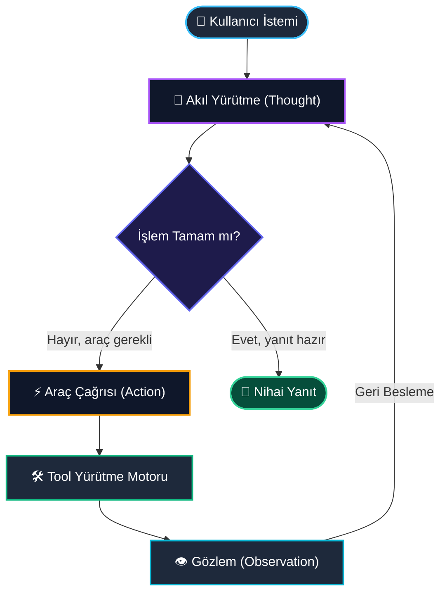
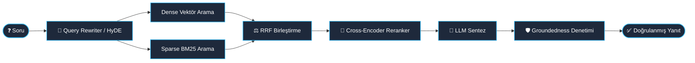
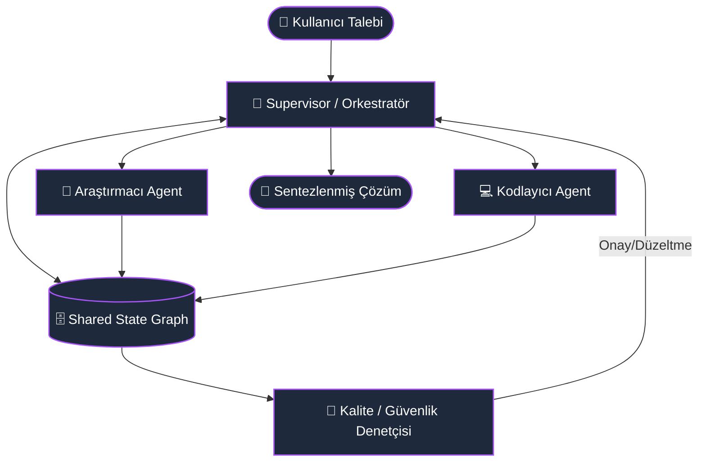

<!-- _class: lead -->
# 🤖 AI Agents Bootcamp
### Otonom Yapay Zekâ Sistemleri ve Ajan Mimarileri

**Türkiye Veri Topluluğu**
*6 Hafta • Uygulamalı • Proje & Üretim Odaklı*

<br>

<span class="tag">LLMs</span>
<span class="tag">Function Calling</span>
<span class="tag">ReAct & Memory</span>
<span class="tag">Advanced RAG</span>
<span class="tag">Multi-Agent</span>
<span class="tag">Production Deployment</span>

<!--
Speaker Notes:
- Katılımcılara sıcak bir karşılama yapın ve Türkiye Veri Topluluğu vizyonundan bahsedin.
- Bu bootcamp'in basit chatbot'lar yapmanın ötesine geçerek, otonom kararlar alabilen endüstri standardı AI Agent sistemleri geliştirmeyi amaçladığını vurgulayın.
- 6 haftalık yolculuğun teori ile pratik kodlamayı (Hands-on) bir araya getirdiğini belirtin.
-->

---

## 🗺️ 6 Haftalık Müfredat Yol Haritası

- **1. Hafta:** LLM Temelleri, Tokenizasyon & İleri Prompt Mühendisliği
- **2. Hafta:** Tool Use, Function Calling & Yapılandırılmış Çıktılar (JSON Mode)
- **3. Hafta:** Otonom Agent Döngüleri (ReAct, Plan-and-Solve) & Bellek Sistemleri
- **4. Hafta:** Gelişmiş RAG (Retrieval-Augmented Generation) & Vektör Veritabanları
- **5. Hafta:** Çoklu Ajan Sistemleri (Multi-Agent Systems) & Orkestrasyon (LangGraph)
- **6. Hafta:** Bitirme Projesi, Observability, Deployment & Değerlendirme

> "Agent = LLM (Beyin) + Tools (Eller/Gözler) + Memory (Hafıza) + Planning (Strateji)"

<!--
Speaker Notes:
- Yol haritasındaki her haftanın bir öncekinin üstüne inşa edildiğini açıklayın.
- Katılımcıların 1. haftada temelleri sağlama alıp 6. haftada çalışan uçtan uca bir ürünü canlıya alacaklarını belirtin.
-->

---

## 📅 Hafta 1: LLM Temelleri & Prompt Engineering

### Teknik Odak Noktaları
- **İçsel Model Mekanikleri:** Tokenizasyon, Next-Token Prediction olasılık dağılımları ve Context Window sınırları.
- **Parametre İnce Ayarları:** `Temperature`, `Top-p`, `Top-k` ve `Frequency/Presence Penalty` parametrelerinin model çıktısına deterministik vs. yaratıcı etkileri.
- **İleri Prompt Teknikleri:** Zero-Shot, Few-Shot, Chain-of-Thought (CoT), Self-Consistency ve Least-to-Most prompting stratejileri.
- **Sistem İstemleri & Rol Ayrımı:** `System`, `User` ve `Assistant` rollerinin izolasyonu, prompt injection güvenlik açıkları ve savunma mekanizmaları.

<!--
Speaker Notes:
- Modellerin "düşünmediğini", token olasılıkları üzerinden en makul devamı tahmin ettiğini açıklayın.
- Temperature = 0'ın kod üretimi ve deterministik JSON çıktıları için neden kritik olduğunu vurgulayın.
- Few-shot örneklemenin karmaşık görevlerde başarıyı nasıl %30-40 oranında artırabildiğini örnekleyin.
-->

---

## 💡 Hafta 1: Uygulama Laboratuvarı & Kod Deseni

```python
from openai import OpenAI
client = OpenAI()

system_prompt = """Sen bir Kıdemli Veri Mimarı Rolündesin.
Verilen kullanıcı isterlerini analiz et ve sadece geçerli JSON şemasında çıktı ver.
Format: {"schema": "string", "tables": [...], "primary_keys": [...]}"""

response = client.chat.completions.create(
    model="gpt-4o",
    messages=[
        {"role": "system", "content": system_prompt},
        {"role": "user", "content": "E-ticaret sipariş takip veritabanı tasarla."}
    ],
    response_format={"type": "json_object"},
    temperature=0.1
)
print(response.choices[0].message.content)
```

- **Haftanın Ödevi:** Yapılandırılmış Çıktı (JSON Mode) ile çalışan Doğal Dil SQL Çeviricisi Prompt Kütüphanesi.

<!--
Speaker Notes:
- response_format={"type": "json_object"} kullanımının downstream sistemler için kırılganlığı nasıl engellediğini gösterin.
- Canlı demo yaparken hata durumlarını (örneğin JSON schema dışına taşma) simüle edin.
-->

---

## 📅 Hafta 2: Tool Use & Function Calling

### Teknik Odak Noktaları
- **Model Dış Dünyaya Nasıl Bağlanır?** Statik model bilgisinden canlı API ve veritabanı etkileşimine geçiş prensibi.
- **JSON Schema ile Araç Tanımlama:** Modelin araçları anlayabilmesi için fonksiyon isimleri, parametre tipleri ve docstring'lerin kesin tanımlanması.
- **Fonksiyon Çağırma Döngüsü:** Modelin bir aracı çağırma isteği oluşturması, istemcinin aracı çalıştırması ve sonucun `tool` rolüyle modele geri beslenmesi.
- **Hata Yönetimi & Yeniden Deneme:** Hatalı parametre üreten modellerde exception handling ve otomatik self-repair stratejileri.

<!--
Speaker Notes:
- Modelin kendisinin kodu veya API'yi çalıştırmadığını, yalnızca "Bu fonksiyonu şu argümanlarla çalıştır" talimatı (tool_calls) verdiğini netleştirin.
- En sık yapılan öğrenci hatası: Modelin fonksiyonu kendi içinde çalıştırdığını sanması.
-->

---

## 🛠️ Hafta 2: Function Calling Mimari Akışı

```
[Kullanıcı] ---> "İstanbul'da şu an hava kaç derece?"
     │
     ▼
[LLM] --------> Tool Call Kararı: get_weather(city="Istanbul")
     │
     ▼
[Execution Runtime] -> get_weather("Istanbul") çağrılır -> {"temp": 18, "desc": "Güneşli"}
     │
     ▼
[LLM] <-------- Gözlem (Tool Output) Modele Geri İletilir
     │
     ▼
[Kullanıcı] <--- "İstanbul'da şu an hava 18°C ve güneşli."
```

- **Araç Güvenliği:** Salt-okunur (read-only) API'ler ile işlem yapıcı (write/execute) API'lerin ayrıştırılması ve Human-in-the-Loop (HITL) onayı.

<!--
Speaker Notes:
- Write operasyonlarında (SQL UPDATE, para transferi, e-posta atma) araya mutlaka kullanıcı onay mekanizması (Human-in-the-loop) konması gerektiğini vurgulayın.
-->

---

## 📅 Hafta 3: Agent Mimarileri & Bellek Sistemleri

### Teknik Odak Noktaları
- **ReAct (Reasoning + Acting) Deseni:** Modelin bir sonuca varmak için adım adım akıl yürütmesi (Thought), aksiyon alması (Action) ve çevreyi gözlemlemesi (Observation).
- **Plan-and-Solve & Reflexion:** Karmaşık hedefleri alt görevlere bölme, dinamik plan güncelleme ve başarısız denemelerden ders çıkarma.
- **Bellek (Memory) Hiyerarşisi:**
  * *Kısa Dönem (Scratchpad / Working Memory):* Mevcut yürütme döngüsü ve context window.
  * *Uzun Dönem (Episodic & Semantic Memory):* Vektör tabanlı depolama, kullanıcı tercihleri ve geçmiş seanslar.
- **Döngü Yönetimi (Termination & Safeguards):** Sonsuz döngüleri engellemek için `max_iterations` ve bütçe/token sınırları.

<!--
Speaker Notes:
- ReAct makalesinin (Yao et al., 2022) temel fikrini anlatın.
- Salt CoT (düşünce) vs Salt Act (hareket) yerine ikisinin birleşiminin halüsinasyonu nasıl azalttığını açıklayın.
-->

---

## 🔄 Hafta 3: Tekil Agent Döngüsü (ReAct)



<!--
Speaker Notes:
- Bu döngünün bir finite state machine (FSM) gibi çalıştığına dikkat çekin.
- Observation'ın modele bir sonraki Thought için zemin hazırladığını belirtin.
-->

---

## 📅 Hafta 4: RAG (Retrieval-Augmented Generation)

### Teknik Odak Noktaları
- **Naive RAG Kırılganlıkları:** Yanlış chunk boyutu, semantik kopukluk, "Lost in the Middle" problemi ve ilgisiz retrieval sonuçları.
- **Gelişmiş Chunking & Parsing:** Sentence-window, hierarchical/parent-document chunking ve tablolara duyarlı parsing.
- **Hibrit Arama (Hybrid Search):** Dense Retrieval (Vektör mesafesi - Cosine/Dot Product) + Sparse Retrieval (BM25) ve Reciprocal Rank Fusion (RRF).
- **Reranking & Context Compression:** Cross-Encoder modelleri (bge-reranker, Cohere) ile bağlamı filtreleme ve token tasarrufu.
- **RAG Değerlendirme (RAG Triad):** Context Relevance, Groundedness (Faithfulness) ve Answer Relevance metrikleri (RAGAS framework).

<!--
Speaker Notes:
- Sektörde en çok yapılan hata: PDF'i 500'lük chunk'lara bölüp Pinecone'a atıp mucize beklemek.
- Reranking adımının retrieval kalitesini sıklıkla %20-30 iyileştirdiğini anlatın.
- Halüsinasyonu engellemek için metrik bazlı (RAGAS) test yapmanın önemini vurgulayın.
-->

---

## 📚 Hafta 4: Gelişmiş RAG Mimarisi



- **Agentic RAG:** Agent'ın "Bu doküman yeterli mi?" sorusunu sorup gerekirse web aramasına başvurması veya alt sorgular türetmesi.

<!--
Speaker Notes:
- Agentic RAG ile standart RAG arasındaki fark: Standart RAG tek atımlı (one-shot) iken, Agentic RAG iteratiftir.
- Bilgi yetersiz olduğunda agent stratejisini değiştirir.
-->

---

## 📅 Hafta 5: Çoklu Ajan (Multi-Agent) Sistemleri

### Teknik Odak Noktaları
- **Neden Multi-Agent?** Tekil modellerde aşırı context yüklenmesi, rol karmaşası ve uzmanlaşamama sorunlarının aşılması.
- **Mimari Desenler:**
  * *Supervisor / Hierarchical:* Üst yönetici agent görevleri dağıtır, alt uzmanlar icra eder.
  * *Peer-to-Peer / Network:* Ajanlar birbirleriyle direkt mesajlaşarak konsensüs arar (Chat Room / Round Robin).
  * *Blackboard (Paylaşılan Durum):* Ortak bir state objesi üzerinden asenkron veri paylaşımı.
- **LangGraph & StateGraph:** Graf tabanlı durum yönetimi, döngüsel kenarlar (cyclic graphs) ve kalıcılık (persistence/checkpointing).
- **Ajanlar Arası İletişim Protokolü:** Structured schemas, veri doğrulama ve çatışma çözümü (conflict resolution).

<!--
Speaker Notes:
- Multi-agent sistemlerin bir yazılım mühendisliği takımına benzediğini söyleyin: Product Manager, Developer, QA Tester rolleri.
- LangGraph'ın DAG (Acyclic) yerine döngülere (cyclic) izin vermesinin agent akışları için neden devrim olduğunu anlatın.
-->

---

## 👥 Hafta 5: Supervisor & Worker Mimarisi



- **Human-in-the-loop (HITL):** Kritik karar anlarında agent yürütmesini durdurup insandan girdi veya onay alma.

<!--
Speaker Notes:
- Supervisor'ın dinamik router olarak çalıştığını, sıradaki agent'a State üzerinden karar verdiğini açıklayın.
- Checkpointing sayesinde sistem çöktüğünde kaldığı yerden devam edebildiğini ekleyin.
-->

---

## 📅 Hafta 6: Proje Geliştirme, Deployment & Değerlendirme

### Teknik Odak Noktaları
- **Observability & Tracing:** Agent'ın arka planda ne yaptığını şeffafça izleme (LangSmith, Arize Phoenix, OpenTelemetry).
- **Guardrails & Güvenlik:** NeMo Guardrails, Llama-Guard, Prompt Injection engelleme, PII (Kişisel Veri) maskeleme.
- **Production Deployment:**
  * Asenkron Streaming (Server-Sent Events / SSE) ile anlık yanıt aktarımı.
  * FastAPI / Docker konteynerizasyonu ve Rate-Limiting.
- **Bitirme Projesi Kriterleri:**
  1. En az 2 harici araç (Tool) entegrasyonu.
  2. Bellek (Memory) veya Vektör RAG kullanımı.
  3. Hata yönetimi (Self-Correction) ve canlı demo arayüzü (Streamlit / Chainlit / Next.js).

<!--
Speaker Notes:
- Tracing olmadan production'da bir agent'ı debug etmenin imkansız olduğunu söyleyin. Bir tool patladığında neden patladığını LangSmith izlerinden görürüz.
- Bitirme projesinin katılımcıların portfolyosu için anahtar parça olacağını vurgulayın.
-->

---

## 🚀 Başarı Kriterleri & Sonraki Adımlar

### Bootcamp Çıktıları
- ✅ Production-ready AI Agent mimarisi tasarlayabilme kabiliyeti
- ✅ RAG sistemlerinde halüsinasyonu sıfırlamaya yakın optimize edebilme
- ✅ Çoklu ajan sistemlerinde orkestrasyon ve durum yönetimi ustalığı
- ✅ GitHub üzerinde açık kaynak katkısı ve bitirme projesi repo teslimi

<br>

> **"Geleceğin yazılımı kod yazmak değil, kod yazan ve düşünen ajanları yönetmektir."**

**Sorular & Tartışma**  
Türkiye Veri Topluluğu Discord & GitHub Topluluğu

<!--
Speaker Notes:
- Katılımcıları Discord kanallarına ve GitHub tartışmalarına davet edin.
- Bitirme projeleri için takımlar kurulmasını teşvik edin ve mentorluk saatlerini hatırlatın.
-->
